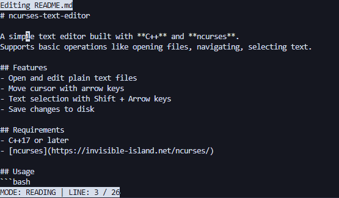

# ncurses-text-editor

A simple text editor built with **C++** and **ncurses**.  
Supports basic operations like opening files, navigating, selecting text.

## Features
- Open and edit plain text files
- Move cursor with arrow keys
- Text selection with Shift + Arrow keys
- Save changes to disk

## Requirements
- C++17 or later
- [ncurses](https://invisible-island.net/ncurses/)

## Usage
```bash
./texto myfile.txt
```
Keybindings
- Arrow keys – move cursor
- Shift + Arrow keys – select text
- CTRL+I - insertion mode (reading mode)
- ESC - reading mode (insertion mode)
- Ctrl+S – save file (reading mode)
- Ctrl+W – quit (reading mode)

## Screenshot
